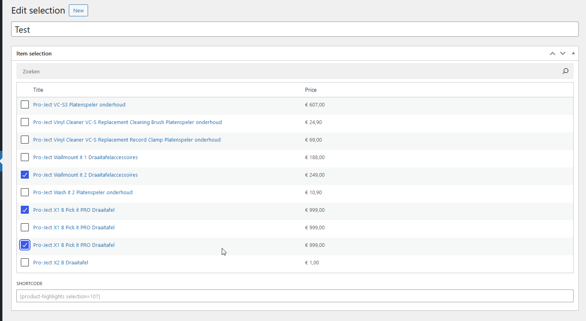

# Affiliate Product Highlights #
**Contributors:** koen12344  
**Donate link:** https://koenreus.com  
**Tags:** tradetracker, adtraction, affiliate, feed, products  
**Requires at least:** 5.1  
**Tested up to:** 6.6.1  
**Requires PHP:** 7.0  
**Stable tag:** 0.1.0  
**License:** GPLv2 or later  
**License URI:** https://www.gnu.org/licenses/gpl-2.0.html  

A beautiful way to display products from affiliate network product feeds on your website. Currently supports TradeTracker and AdTraction.

## Description ##

With the **Affiliate Product Highlights** plugin for WordPress you can create beautiful in-content sections showing relevant
products from product feeds of various affiliate networks.

Currently supports TradeTracker and AdTraction.

* **Automatic product feed import**: Product feeds are updated daily for up-to-date pricing and product availability
* **Cloaked links**: Affiliate links are redirected through your own website URL
* **Fast & efficient**: Product data is stored locally, product images are sideloaded and optimized
* **Flexible shortcode**: Show random products, specific products, search by (partial) product name

## Installation ##

1. Download [the latest version](https://github.com/koen12344/affiliate-product-highlights/releases/latest)
1. Upload the plugin through 'Plugins' > 'Add New' > 'Upload plugin' in your WordPress Dashboard
1. Add one or more affiliate product feeds through 'Affiliate Product Highlights' > 'Feeds'
1. Place the [product-highlights] shortcode wherever you want to display your affiliate products using attributes below

**Supported shortcode attributes:**
* **selection**: An ID of a selection of products generated through 'Affiliate Product Highlights' > 'Selections'
* **limit**: The amount of products that should be displayed (default: 6)
* **product_ids**: Display specific product IDs. Separated by a comma, e.g. 123,323,312 (currently no easy way to get these IDs apart from going into PHPMyAdmin)
* **search**: Show only products containing this word or sentence in their title (may be inefficient with a lot of products in the database)
* **random**: Randomize the results

## Frequently Asked Questions ##

## Screenshots ##

### 1. Plugin in action on the frontend ###

### 2. Making a selection of specific products ###

## Changelog ##

### 0.1.0 ###
* Initial public alpha release

## Upgrade Notice ##
